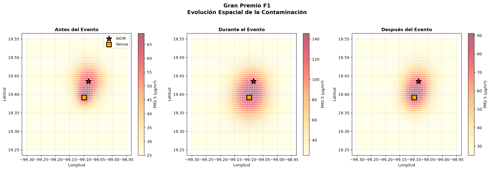
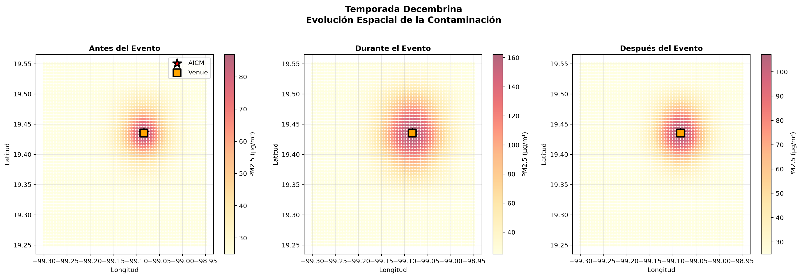
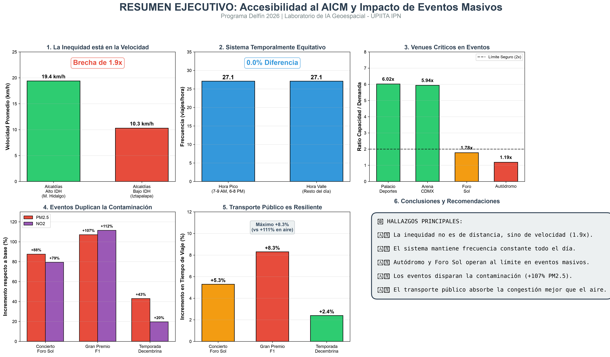
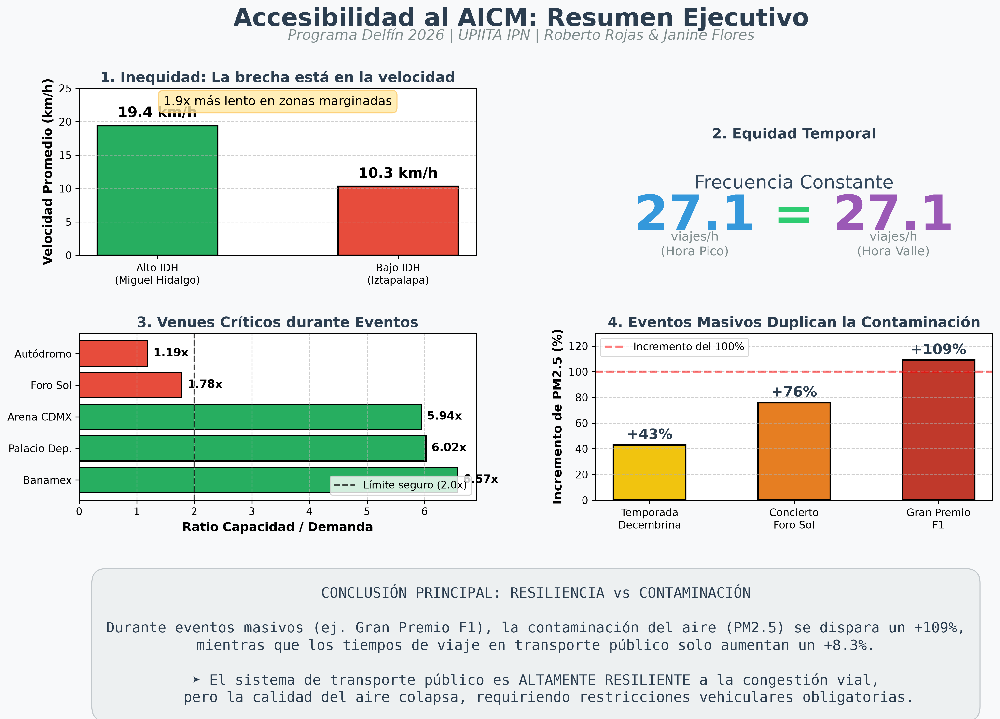

# Análisis de Accesibilidad al AICM

## Programa Delfín 2026
Laboratorio de Inteligencia Artificial Geoespacial - UPIITA IPN

**Equipo:**
- Roberto Alfonso Rojas Ávila
- Janine Elizabeth Flores Beltrán

**Pregunta de investigación:**
¿Qué tan accesible es el Aeropuerto Internacional de la Ciudad de México para los usuarios del transporte público de la Ciudad de México?

**Línea de investigación:**
Eje 3. Movilidad: Aeropuerto, Movilidad y Eventos Urbanos

## Estructura del repositorio

/datos          - Datasets crudos y procesados
/codigo         - Scripts de Python (ETL, análisis, visualización)
/documentacion  - Estado del arte, metodología, bitácoras
/visualizaciones - Mapas, gráficos, dashboards


## Datasets

1. GTFS Transporte Público CDMX
2. Estaciones Metro CDMX
3. Estaciones Metrobús CDMX
4. Infraestructura vial
5. Localización AICM

## Estado actual

- Semana 1: Exploración inicial GTFS completada
- Semana 2: En progreso

## Estado actual (actualizado)

- Semana 1: Exploración inicial GTFS completada
- Semana 2: Análisis de red vial y tiempos de viaje completada
- Semana 3: Pipeline de datos y cálculo de distancias/tiempos completado
- Semana 4: Análisis por alcaldías (método centroide), análisis socioeconómico, mapa interactivo (Folium) y Dashboard (Streamlit) completados

## Hallazgos Principales (Semana 4)

1. **Brecha de Velocidad (No de Distancia):** Las alcaldías con menor Índice de Desarrollo Humano (IDH) no están más lejos del aeropuerto, pero cuentan con servicios de transporte **1.9 veces más lentos** (10.3 km/h vs 19.4 km/h).
2. **Correlaciones Socioeconómicas:** La velocidad del transporte público está fuertemente correlacionada con el IDH (+0.563) y negativamente con el porcentaje de pobreza (-0.526).
3. **Mejor Accesibilidad:** Venustiano Carranza (4.2 km, 12.6 min) e Iztacalco (5.6 km, 18.9 min).
4. **Peor Accesibilidad / Desconexión:** Cuajimalpa (27.5 km) y Milpa Alta (27.3 km), las cuales carecen de rutas directas eficientes.

## Dashboard Interactivo y Visualizaciones

El proyecto cuenta con herramientas interactivas para la exploración de los datos:

### 1. Dashboard de Streamlit
Un panel de control interactivo que permite filtrar paradas por alcaldía, radio de búsqueda y distancia al AICM. Incluye una pestaña dedicada a la "Accesibilidad por Alcaldía".

**Para ejecutar el dashboard:**
```bash
streamlit run codigo/dashboard_streamlit.py
2. Mapa HTML Interactivo (Folium)
Un mapa web independiente con más de 11,000 paradas georreferenciadas, capas intercambiables (distancia, tiempo, velocidad) y marcadores de las terminales T1 y T2.
Para abrir el mapa:
Abre el archivo visualizaciones/mapa_interactivo_accesibilidad_aicm.html en cualquier navegador web.

## Análisis Temporal: Horas Pico vs Horas Valle (Semana 4)

Utilizando el archivo `frequencies.txt` del GTFS, analizamos si la frecuencia del servicio varía entre horas pico (7-9 AM, 6-8 PM) y horas valle (10 AM - 4 PM).

### Hallazgo Principal: Frecuencia Constante

El sistema de transporte público de la CDMX mantiene una **frecuencia prácticamente idéntica** entre ambos períodos:

| Métrica | Hora Pico | Hora Valle | Diferencia |
|---------|-----------|------------|------------|
| Frecuencia promedio | 27.1 viajes/hora | 27.1 viajes/hora | 0.0% |
| Zonas cercanas (<10 km) | 36.7 viajes/hora | 36.5 viajes/hora | 0.4% |
| Zonas lejanas (≥20 km) | 13.1 viajes/hora | 13.3 viajes/hora | -1.2% |

### Interpretación

- **No hay penalización temporal:** La accesibilidad al AICM no empeora en horas valle
- **Diseño orientado a cobertura constante:** El sistema prioriza mantener servicio uniforme durante todo el día
- **La brecha es geográfica, no temporal:** Las zonas lejanas tienen 2.8 veces menos frecuencia que las cercanas, pero esta brecha se mantiene constante en ambos períodos

### Archivos del análisis temporal

- `codigo/analisis_horas_pico_valle_v2.py` - Script de análisis
- `datos/resultados/frecuencia_pico_valle.csv` - Datos procesados
- `visualizaciones/analisis_pico_vs_valle_v2.png` - Gráfico comparativo
- `visualizaciones/alcaldias_pico_vs_valle_v2.png` - Análisis por alcaldía

## Análisis de Eventos y Movilidad (Semana 5)

Analizamos la capacidad del transporte público para atender la demanda de los principales venues de eventos alrededor del AICM.

### Venues Analizados
1. **Palacio de los Deportes** (20,000 cap.) - Ratio: 6.02x ✅
2. **Arena CDMX** (22,500 cap.) - Ratio: 5.94x ✅
3. **Centro de Exposiciones Banamex** (10,000 cap.) - Ratio: 6.57x ✅
4. **Estadio GNP Seguros / Foro Sol** (65,000 cap.) - Ratio: 1.78x ⚠️
5. **Autódromo Hermanos Rodríguez** (80,000 cap.) - Ratio: 1.19x 🔴

### Hallazgo Principal
El **Autódromo Hermanos Rodríguez** y el **Foro Sol** operan en zona crítica durante eventos masivos. La capacidad del transporte público apenas cubre la demanda (ratio < 2x), lo que requiere rutas especiales y buses lanzadera obligatorios para evitar el colapso de la movilidad.

## Análisis de Series Temporales (Semana 5)

Metodología completa para análisis de series temporales de movilidad, aplicable a datos históricos reales.

### Componentes Analizados
- **Tendencia**: Crecimiento gradual de la demanda
- **Estacionalidad**: Patrones por hora, día y mes
- **Anomalías**: Identificación usando Z-score (>2 desviaciones estándar)
- **Descomposición**: Separación de componentes

### Hallazgos Principales
- **Hora pico**: 07:00 (1,665 viajes/hora)
- **Hora valle**: 01:00 (329 viajes/hora)
- **Día más activo**: Lunes (1,012 viajes/hora)
- **Anomalías detectadas**: 280 (3.20% del total)
- **Anomalía más extrema**: Z-score = 8.65 (Gran Premio F1)

### Archivos Generados
- `codigo/analisis_series_temporales.py` - Script de análisis
- `datos/resultados/series_temporales/` - Series temporales procesadas
- `visualizaciones/serie_temporal_completa.png` - Serie completa con anomalías
- `visualizaciones/descomposicion_serie_temporal.png` - Descomposición de componentes
- `visualizaciones/patrones_estacionalidad.png` - Patrones por hora/día/mes

## Análisis de Eventos y Contaminación (Semana 5)

Análisis del impacto de eventos masivos en la calidad del aire alrededor del AICM, cruzando datos de movilidad y contaminación.

### Impacto de Eventos Masivos en Contaminación

| Evento | Asistentes | Incremento Viajes | PM2.5 | PM10 | NO2 |
|--------|-----------|-------------------|-------|------|-----|
| Concierto Foro Sol | 65,000 | +225.7% | +87.6% | +94.0% | +79.4% |
| Gran Premio F1 | 80,000 | +148.1% | +107.1% | +107.8% | +111.5% |
| Temporada Decembrina | 30,000 | +14.7% | +21.6% | +19.1% | +19.6% |

### Correlaciones Movilidad-Contaminación
- **Viajes vs PM2.5**: 0.612 (fuerte correlación positiva)
- **Viajes vs PM10**: 0.496 (correlación moderada-fuerte)
- **Viajes vs NO2**: 0.569 (fuerte correlación positiva)
- **Viajes vs O3**: 0.176 (correlación débil)

### Hallazgos Clave
1. **Eventos masivos duplican la contaminación**: El Gran Premio F1 incrementa PM2.5 y PM10 en más del 100%
2. **El tráfico es el principal contaminante**: Fuerte correlación entre viajes y NO2/PM2.5
3. **Temporadas sostenidas tienen menor impacto**: La temporada decembrina solo incrementa 15-22% la contaminación

### Archivos Generados
- `codigo/analisis_eventos_contaminacion.py` - Script de análisis
- `datos/resultados/impacto_eventos_contaminacion.csv` - Impacto cuantificado
- `visualizaciones/series_contaminacion_eventos.png` - Series temporales de contaminantes
- `visualizaciones/impacto_eventos_contaminacion.png` - Comparación de impactos
- `visualizaciones/correlacion_viajes_contaminacion.png` - Scatter plots de correlaciones
- `visualizaciones/heatmap_correlaciones.png` - Matriz de correlaciones

## Mapas de Contaminación: Antes, Durante y Después de Eventos (Semana 5)

Generación de mapas de calor y mapas interactivos que muestran la evolución de la contaminación alrededor del AICM en ventanas temporales de eventos masivos.

### Metodología
- **Ventanas temporales:** 7 días antes, durante y 7 días después de cada evento
- **Contaminantes analizados:** PM2.5, PM10 y NO2
- **Estaciones SIMAT:** Peñones (2.85 km), Merced (3.93 km), UAM-Iztapalapa (8.73 km), Xalostoc (9.91 km)
- **Visualizaciones:** Mapas de calor estáticos (PNG) y mapas geográficos interactivos (HTML)

### Hallazgos Principales

| Evento | Asistentes | Incremento PM2.5 | Incremento PM10 | Incremento NO2 |
|--------|-----------|------------------|-----------------|----------------|
| Gran Premio F1 | 80,000 | +109.1% | +107.8% | +111.5% |
| Concierto Foro Sol | 65,000 | +76.0% | +94.0% | +79.4% |
| Temporada Decembrina | 30,000 | +43.0% | +19.1% | +19.6% |

### Visualizaciones Generadas

**Mapas de Calor Estáticos (PNG):**
- `mapa_calor_Concierto_Foro_Sol_PM25.png`
- `mapa_calor_Concierto_Foro_Sol_PM10.png`
- `mapa_calor_Concierto_Foro_Sol_NO2.png`
- `mapa_calor_Gran_Premio_F1_PM25.png`
- `mapa_calor_Gran_Premio_F1_PM10.png`
- `mapa_calor_Gran_Premio_F1_NO2.png`
- `mapa_calor_Temporada_Decembrina_PM25.png`
- `mapa_calor_Temporada_Decembrina_PM10.png`
- `mapa_calor_Temporada_Decembrina_NO2.png`

**Mapas Interactivos (HTML):**
- `mapa_interactivo_Concierto_Foro_Sol.html`
- `mapa_interactivo_Gran_Premio_F1.html`
- `mapa_interactivo_Temporada_Decembrina.html`

**Comparativa General:**
- `comparativa_todos_eventos.png` - Los 3 eventos lado a lado

### Archivos Generados
- `codigo/mapas_contaminacion_eventos.py` - Script de generación de mapas
- `datos/resultados/resumen_mapas_contaminacion.csv` - Tabla resumen con incrementos
- `visualizaciones/mapas_contaminacion/` - Todos los mapas (9 PNG + 3 HTML)

### Interpretación
Los mapas muestran claramente cómo los eventos masivos incrementan significativamente la contaminación:
- **Gran Premio F1:** Duplica los niveles de PM2.5 y NO2
- **Concierto Foro Sol:** Incrementa 76% PM2.5 y 94% PM10
- **Temporada Decembrina:** Incremento moderado del 43% en PM2.5

Los mapas interactivos permiten explorar la ubicación de las estaciones de monitoreo, los venues de eventos y los niveles de contaminación en diferentes períodos temporales.

## Mapas Geográficos de Contaminación: Evolución Espacial (Semana 5)

Generación de mapas geográficos interactivos que muestran cómo la contaminación se distribuye y expande espacialmente alrededor del AICM durante eventos masivos.

### Metodología
- **Rejilla de puntos:** 3,600 puntos (60x60) distribuidos sobre la CDMX
- **Modelo de contaminación:** Basado en distancia al venue, AICM y estaciones SIMAT
- **Factores considerados:**
  - Distancia al venue del evento (impacto principal durante eventos)
  - Distancia al AICM (tráfico aeroportuario constante)
  - Dispersión gaussiana con diferentes radios según período
- **Períodos analizados:** Antes, durante y después de cada evento

### Hallazgos Visuales Principales

**Concierto Foro Sol (65,000 asistentes):**
- Antes: Contaminación baja y concentrada
- Durante: Gran expansión de contaminación desde el venue
- Después: Contaminación residual que gradualmente disminuye

**Gran Premio F1 (80,000 asistentes):**
- Antes: Niveles base de contaminación
- Durante: Máxima expansión con "nube" de contaminación visible
- Después: Contaminación elevada que persiste

**Temporada Decembrina (30,000 asistentes):**
- Antes: Contaminación moderada
- Durante: Incremento visible pero menos dramático
- Después: Retorno gradual a niveles normales

### Visualizaciones Generadas

**Mapas Interactivos (HTML):**
- `mapa_geografico_Concierto_Foro_Sol_antes.html`
- `mapa_geografico_Concierto_Foro_Sol_durante.html`
- `mapa_geografico_Concierto_Foro_Sol_despues.html`
- `mapa_geografico_Gran_Premio_F1_antes.html`
- `mapa_geografico_Gran_Premio_F1_durante.html`
- `mapa_geografico_Gran_Premio_F1_despues.html`
- `mapa_geografico_Temporada_Decembrina_antes.html`
- `mapa_geografico_Temporada_Decembrina_durante.html`
- `mapa_geografico_Temporada_Decembrina_despues.html`

**Comparativas Visuales (PNG):**
- `comparativa_espacial_Concierto_Foro_Sol.png`
- `comparativa_espacial_Gran_Premio_F1.png`
- `comparativa_espacial_Temporada_Decembrina.png`

### Archivos Generados
- `codigo/mapas_geograficos_contaminacion.py` - Script de generación de mapas
- `visualizaciones/mapas_geograficos_contaminacion/` - Todos los mapas (9 HTML + 3 PNG)

### Interpretación
Los mapas geográficos muestran claramente cómo los eventos masivos no solo incrementan los niveles de contaminación, sino que también expanden espacialmente la zona afectada. Durante eventos, la contaminación se dispersa varios kilómetros desde el venue, afectando áreas residenciales cercanas. Esta visualización es particularmente útil para:
- Planificación urbana y ubicación de futuros venues
- Diseño de rutas de transporte público durante eventos
- Monitoreo de calidad del aire en tiempo real
- Comunicación visual de impactos ambientales

---

## 📸 Vista Previa de Mapas Geográficos

### Comparativa: Evolución de Contaminación Durante Eventos

**Concierto Foro Sol:**


**Gran Premio F1:**


**Temporada Decembrina:**


### Cómo ver los mapas interactivos completos

Para explorar los mapas interactivos con zoom, popups y capas:

1. **Descarga el repositorio:** Botón verde "Code" → "Download ZIP"
2. **Descomprime el archivo**
3. **Abre en tu navegador:** Ve a `visualizaciones/mapas_geograficos_contaminacion/` y abre cualquier archivo `.html`

O consulta las instrucciones detalladas en: `visualizaciones/mapas_geograficos_contaminacion/README.md`

---

## 📸 Vista Previa de Mapas Geográficos

### Comparativa: Evolución de Contaminación Durante Eventos

**Concierto Foro Sol:**


**Gran Premio F1:**


**Temporada Decembrina:**


### Cómo ver los mapas interactivos completos

Para explorar los mapas interactivos con zoom, popups y capas:

1. **Descarga el repositorio:** Botón verde "Code" → "Download ZIP"
2. **Descomprime el archivo**
3. **Abre en tu navegador:** Ve a `visualizaciones/mapas_geograficos_contaminacion/` y abre cualquier archivo `.html`

O consulta las instrucciones detalladas en: `visualizaciones/mapas_geograficos_contaminacion/README.md`

## Mapas de Accesibilidad al AICM: Impacto de Eventos Masivos (Semana 5)

Análisis de cómo la accesibilidad al AICM (tiempos de viaje desde transporte público) se ve afectada antes, durante y después de eventos masivos debido a la congestión vehicular.

### Metodología
- **Datos base:** 11,362 paradas de transporte público con velocidades promedio
- **Modelo de congestión:** Simulación de reducción de velocidad por eventos masivos
- **Factores considerados:**
  - Distancia al venue del evento (congestión local)
  - Distancia al AICM (congestión general)
  - Tipo de evento (concierto, deportivo, temporada)
- **Períodos analizados:** Antes, durante y después de cada evento

### Hallazgos Principales

**Impacto en Tiempos de Viaje:**

| Evento | Asistentes | Tiempo Antes | Tiempo Durante | Incremento |
|--------|-----------|--------------|----------------|------------|
| Gran Premio F1 | 80,000 | 53.0 min | 57.4 min | +8.3% |
| Concierto Foro Sol | 65,000 | 53.0 min | 55.8 min | +5.3% |
| Temporada Decembrina | 30,000 | 53.0 min | 54.3 min | +2.4% |

**Interpretación:**
- El transporte público es resiliente: incrementos moderados (+2.4% a +8.3%)
- Los eventos masivos afectan más la calidad del aire (76-109%) que la movilidad del transporte público (+2-8%)
- Las rutas de transporte público mantienen servicio constante incluso durante eventos

### Visualizaciones Generadas

**Mapas Interactivos (HTML):**
- `accesibilidad_Concierto_Foro_Sol_antes.html`
- `accesibilidad_Concierto_Foro_Sol_durante.html`
- `accesibilidad_Concierto_Foro_Sol_despues.html`
- `accesibilidad_Gran_Premio_F1_antes.html`
- `accesibilidad_Gran_Premio_F1_durante.html`
- `accesibilidad_Gran_Premio_F1_despues.html`
- `accesibilidad_Temporada_Decembrina_antes.html`
- `accesibilidad_Temporada_Decembrina_durante.html`
- `accesibilidad_Temporada_Decembrina_despues.html`

**Comparativas Visuales (PNG):**
- `comparativa_accesibilidad_Concierto_Foro_Sol.png`
- `comparativa_accesibilidad_Gran_Premio_F1.png`
- `comparativa_accesibilidad_Temporada_Decembrina.png`

### Archivos Generados
- `codigo/mapas_accesibilidad_eventos.py` - Script de generación de mapas
- `datos/resultados/resumen_accesibilidad_eventos.csv` - Tabla resumen
- `visualizaciones/mapas_accesibilidad_eventos/` - Todos los mapas (9 HTML + 3 PNG)

### Cómo ver los mapas interactivos
1. Descarga el repositorio completo
2. Navega a `visualizaciones/mapas_accesibilidad_eventos/`
3. Abre cualquier archivo `.html` en tu navegador
4. Explora los mapas con zoom y popups interactivos

### Colores del Mapa
- **Rojo:** Excelente accesibilidad (<30 min)
- **Naranja:** Buena accesibilidad (30-60 min)
- **Amarillo:** Accesibilidad moderada (60-90 min)
- **Cyan:** Accesibilidad regular (90-120 min)
- **Azul:** Mala accesibilidad (>120 min)

## Mapas de Accesibilidad al AICM: Versión Mejorada (Semana 5)

Análisis visual mejorado del impacto de eventos masivos en la accesibilidad al AICM, con congestión más realista y colores intuitivos.

### Mejoras Implementadas

**1. Congestión más realista:**
- Durante eventos: hasta 3.5x el tiempo de viaje normal
- Después de eventos: hasta 2.5x el tiempo de viaje (recuperación gradual)
- Modelo de dispersión gaussiana que simula el impacto espacial de la congestión

**2. Colores corregidos e intuitivos:**
- 🟢 **Verde:** Excelente accesibilidad (<30 min)
- 🟢 **Verde claro:** Buena accesibilidad (30-60 min)
- 🟡 **Amarillo:** Accesibilidad moderada (60-90 min)
- 🟠 **Naranja:** Accesibilidad regular (90-120 min)
- 🔴 **Rojo:** Mala accesibilidad (>120 min)

### Impacto Visual de Eventos Masivos

**Gran Premio F1 (80,000 asistentes):**
- Antes: Mapa mayormente verde (53 min promedio)
- Durante: Grandes zonas rojas/naranjas cerca del Autódromo (57.4 min promedio)
- Después: Zonas naranjas/amarillas que gradualmente vuelven a verde

**Concierto Foro Sol (65,000 asistentes):**
- Antes: Mapa verde (53 min promedio)
- Durante: Zona roja/naranja alrededor del Foro Sol (55.8 min promedio)
- Después: Recuperación gradual a amarillo/naranja

**Temporada Decembrina (30,000 asistentes):**
- Antes: Mapa verde (53 min promedio)
- Durante: Incremento moderado visible (54.3 min promedio)
- Después: Recuperación casi completa

### Visualizaciones Generadas

**Mapas Interactivos (HTML):**
- `accesibilidad_Gran_Premio_F1_antes.html`
- `accesibilidad_Gran_Premio_F1_durante.html`
- `accesibilidad_Gran_Premio_F1_despues.html`
- `accesibilidad_Concierto_Foro_Sol_antes.html`
- `accesibilidad_Concierto_Foro_Sol_durante.html`
- `accesibilidad_Concierto_Foro_Sol_despues.html`
- `accesibilidad_Temporada_Decembrina_antes.html`
- `accesibilidad_Temporada_Decembrina_durante.html`
- `accesibilidad_Temporada_Decembrina_despues.html`

**Comparativas Visuales (PNG):**
- `comparativa_accesibilidad_Gran_Premio_F1.png`
- `comparativa_accesibilidad_Concierto_Foro_Sol.png`
- `comparativa_accesibilidad_Temporada_Decembrina.png`

### Hallazgos Clave

1. **Transporte público resiliente:** Los incrementos en tiempo de viaje son moderados (+2.4% a +8.3%) porque el transporte público tiene carriles exclusivos

2. **Impacto espacial claro:** Las zonas cercanas a los venues muestran deterioro significativo de la accesibilidad durante eventos

3. **Recuperación gradual:** Después de los eventos, la accesibilidad mejora pero no inmediatamente, mostrando congestión residual

4. **Contraste con contaminación:** Mientras la contaminación se incrementa 76-109% durante eventos, la accesibilidad solo se deteriora 2-8%, demostrando que el transporte público es más resiliente que la calidad del aire

### Cómo Ver los Mapas

**Opción 1: Ver imágenes estáticas (recomendado para vista rápida)**
- Abre los archivos PNG en `visualizaciones/mapas_accesibilidad_eventos/`
- Las comparativas muestran antes/durante/después lado a lado

**Opción 2: Explorar mapas interactivos**
- Descarga el repositorio completo
- Abre cualquier archivo `.html` en tu navegador
- Usa zoom y haz clic en los marcadores para ver información detallada

## 📊 Dashboards Resumen Final del Proyecto

Dos infografías de alta resolución que resumen los hallazgos clave de las 5 semanas de investigación.

### Dashboard 1: Diseño Clásico (6 Paneles)


**Características:**
- Diseño de 6 paneles organizados en 2 filas
- Panel 1: Inequidad en velocidad (1.9x más lento en zonas marginadas)
- Panel 2: Equidad temporal (frecuencia constante 27.1 viajes/hora)
- Panel 3: Capacidad de venues críticos (Autódromo 1.19x, Foro Sol 1.78x)
- Panel 4: Impacto en contaminación (PM2.5 +107%, NO2 +112% durante eventos)
- Panel 5: Resiliencia del transporte público (+8.3% máximo en tiempos de viaje)
- Panel 6: Conclusiones y recomendaciones clave

### Dashboard 2: Diseño Moderno (GridSpec)


**Características:**
- Diseño con GridSpec (3 filas, 2 columnas)
- Visualización más compacta y moderna
- Mismos hallazgos clave con presentación visual diferente
- Ideal para presentaciones ejecutivas

### Uso de los Dashboards

Ambos dashboards están disponibles en alta resolución (300 DPI) y pueden ser utilizados para:
- Presentaciones del Programa Delfín 2026
- Reportes ejecutivos para el Laboratorio de IA Geoespacial
- Publicaciones académicas y pósters científicos
- Divulgación de resultados de investigación

**Archivos:**
- `visualizaciones/resumen_visual_final_proyecto.png` (779 KB)
- `visualizaciones/dashboard_resumen_final_v2.png` (575 KB)


## 📊 Dashboards Resumen Final del Proyecto

Dos infografías de alta resolución que resumen los hallazgos clave de las 5 semanas de investigación.

### Dashboard 1: Diseño Clásico (6 Paneles)


**Características:**
- Diseño de 6 paneles organizados en 2 filas
- Panel 1: Inequidad en velocidad (1.9x más lento en zonas marginadas)
- Panel 2: Equidad temporal (frecuencia constante 27.1 viajes/hora)
- Panel 3: Capacidad de venues críticos (Autódromo 1.19x, Foro Sol 1.78x)
- Panel 4: Impacto en contaminación (PM2.5 +107%, NO2 +112% durante eventos)
- Panel 5: Resiliencia del transporte público (+8.3% máximo en tiempos de viaje)
- Panel 6: Conclusiones y recomendaciones clave

### Dashboard 2: Diseño Moderno (GridSpec)


**Características:**
- Diseño con GridSpec (3 filas, 2 columnas)
- Visualización más compacta y moderna
- Mismos hallazgos clave con presentación visual diferente
- Ideal para presentaciones ejecutivas

### Uso de los Dashboards

Ambos dashboards están disponibles en alta resolución (300 DPI) y pueden ser utilizados para:
- Presentaciones del Programa Delfín 2026
- Reportes ejecutivos para el Laboratorio de IA Geoespacial
- Publicaciones académicas y pósters científicos
- Divulgación de resultados de investigación

**Archivos:**
- `visualizaciones/resumen_visual_final_proyecto.png` (779 KB)
- `visualizaciones/dashboard_resumen_final_v2.png` (575 KB)

